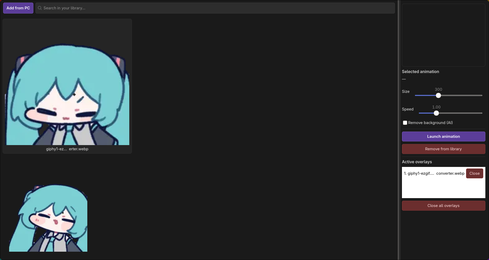

# AnimaEngine-Linux

An open-source alternative to [Anima Engine](https://store.steampowered.com/app/3474900/Anima_Engine/) for Linux. Overlay GIFs, videos, images, and animated WebP files on top of all windows, with AI-powered background removal.



_Built for Wayland compositors (Hyprland, Sway, DriftWM, KDE Plasma 6) with a fallback path for GNOME and X11._

## Features

- **Always-on-top overlay** via `wlr-layer-shell` on Hyprland, Sway, DriftWM, Wayfire, KDE Plasma 6
- **XWayland / X11 fallback** so the app remains usable on GNOME Wayland and any X11 WM
- **Multiple formats** — GIF, PNG, JPG, WebP (static & animated), MP4, WebM, MKV, MOV, AVI
- **AI background removal** powered by U²-Net (and interchangeable ONNX models)
- **Per-frame AI for GIF** — removes background from every frame, keeps animation
- **Per-frame AI for animated WebP** — same pipeline, native WebP output
- **Per-frame AI for video** — decodes frames, processes them, re-encodes to VP8/WebM
- **Drag to position** — move overlays anywhere on screen
- **Size slider** — 32 to 800 px, aspect ratio preserved for video
- **Speed slider** — 0.25x to 3.0x for video, GIF, WebP
- **Looping video** — plays forever, no manual restart
- **Persistent library** — survives restarts (`~/.config/anima-linux/library.json`)
- **Persistent overlays** — active overlays are restored on next launch (`~/.config/anima-linux/overlays.json`)
- **Single-instance lock** — second launch focuses the first window instead of spawning a duplicate
- **User-overridable CSS** — drop your own theme into `~/.config/anima-linux/style.css`
- **Multi-model AI support** — `u2net`, `u2netp`, `silueta`, `isnet-general-use`

## Requirements

- A modern Linux distro with GTK4 and GStreamer 1.24+
- Rust 1.75+
- GStreamer plugins:
  - `gstreamer`
  - `gst-plugins-base`
  - `gst-plugins-good`
  - `gst-plugins-bad`
  - `gst-plugins-ugly`
  - `gst-libav`
  - `gst-plugin-gtk4` (provides `gtk4paintablesink`)
- ONNX Runtime (system library)

## Installation

The app is built from source. Choose the section for your distro.

### Arch Linux

```bash
sudo pacman -S --needed \
  gtk4 gtk4-layer-shell rust \
  gstreamer gst-plugins-base gst-plugins-good gst-plugins-bad \
  gst-plugins-ugly gst-libav gst-plugin-gtk4 \
  onnxruntime-cpu pkg-config gobject-introspection cairo
```

For NVIDIA GPU acceleration, replace `onnxruntime-cpu` with `onnxruntime-cuda`.

### Ubuntu / Debian

Tested on Ubuntu 22.04, 24.04 and Debian 12.

```bash
sudo apt update
sudo apt install -y \
  build-essential pkg-config libssl-dev cmake git wget curl \
  libgtk-4-dev libgtk4-layer-shell-dev \
  libgstreamer1.0-dev libgstreamer-plugins-base1.0-dev \
  gstreamer1.0-plugins-base gstreamer1.0-plugins-good \
  gstreamer1.0-plugins-bad gstreamer1.0-plugins-ugly \
  gstreamer1.0-libav \
  libonnxruntime-dev
```

Install Rust via [rustup](https://rustup.rs/):

```bash
curl --proto '=https' --tlsv1.2 -sSf https://sh.rustup.rs | sh
source "$HOME/.cargo/env"
```

If `libgtk4-layer-shell` and `gstreamer1.0-gtk4` are not packaged for your release, install them from source:

- [gtk4-layer-shell releases](https://github.com/wmww/gtk4-layer-shell)
- `gst-plugin-gtk4` ships in `gst-plugins-rs` — build it from source or install `gstreamer1.0-gtk4` from a PPA/backport when available.

### Fedora

Tested on Fedora 39, 40 and 41.

```bash
sudo dnf install -y \
  gcc gcc-c++ make pkgconf-pkg-config cmake git wget curl \
  gtk4-devel gtk4-layer-shell-devel openssl-devel \
  gstreamer1-devel gstreamer1-plugins-base-devel \
  gstreamer1-plugins-base gstreamer1-plugins-good \
  gstreamer1-plugins-bad-free gstreamer1-plugins-ugly-free \
  gstreamer1-libav gstreamer1-plugin-gtk4 \
  onnxruntime-devel
```

Then install Rust:

```bash
curl --proto '=https' --tlsv1.2 -sSf https://sh.rustup.rs | sh
source "$HOME/.cargo/env"
```

### Build

```bash
git clone https://github.com/0extra/AnimaEngine-Linux.git
cd AnimaEngine-Linux
cargo build --release
./target/release/anima-linux
```

First build takes 5–15 minutes because of GStreamer and ONNX Runtime bindings.

## AI Model Setup

The app uses **U²-Net** via ONNX Runtime. By default it looks for `models/u2net.onnx`.

```bash
mkdir -p models
wget https://github.com/danielgatis/rembg/releases/download/v0.0.0/u2net.onnx -P models/
```

Other supported models from the same releases page:

| Model | File | Input size | Notes |
|---|---|---|---|
| u2net | `u2net.onnx` | 320×320 | default, high quality |
| u2netp | `u2netp.onnx` | 320×320 | smaller, faster |
| silueta | `silueta.onnx` | 320×320 | 43 MB, lightweight |
| isnet-general-use | `isnet-general-use.onnx` | 1024×1024 | higher quality, slower |

Select the model in `config.toml`:

```toml
ai_model = "silueta"
# ai_input_size = 320
# models_dir = "/path/to/models"
```

Model search order:

1. `$ANIMA_MODEL_PATH`
2. `models_dir` from `config.toml`
3. `./models/<file>`
4. `<exe_dir>/models/<file>`
5. `<exe_dir>/../../models/<file>`
6. `/usr/share/anima-linux/models/<file>`
7. `/usr/local/share/anima-linux/models/<file>`
8. `$XDG_DATA_HOME/anima-linux/models/<file>`
9. `$XDG_CONFIG_HOME/anima-linux/models/<file>`
10. `~/.local/share/anima-linux/models/<file>`

ONNX Runtime shared library is auto-detected via:

1. `$ORT_DYLIB_PATH` if already set
2. Common library paths (`/usr/lib`, `/usr/lib64`, `/usr/local/lib`, …)
3. `ldconfig -p` fallback

## Usage

```bash
cargo run --release
# or after building:
./target/release/anima-linux
```

1. Click **Add from PC** to load files into your library
2. Select an item from the grid — its preview appears on the right
3. Adjust **Size** and **Speed** sliders
4. Check **Remove background (AI)** if you want the background removed
5. Click **Launch animation** — the overlay appears on top of all windows
6. Drag the overlay to position it
7. Use the **Active overlays** list to close individual overlays or all at once

Library items and active overlays are saved automatically. Close the app and reopen — everything comes back exactly as you left it.

## Desktop Compatibility

| Desktop / WM | Backend | Always-on-top | Dragging | Exact positioning |
|---|---|---|---|---|
| Hyprland | layer-shell | yes | yes | yes |
| Sway | layer-shell | yes | yes | yes |
| DriftWM | layer-shell | yes | yes | yes |
| Wayfire | layer-shell | yes | yes | yes |
| KDE Plasma 6 (Wayland) | layer-shell | yes | yes | yes |
| KDE Plasma (X11) | X11 | yes | yes | via WM |
| GNOME (Wayland) | XWayland | yes | yes | via WM |
| GNOME (X11) | X11 | yes | yes | via WM |
| Other X11 WMs (i3, openbox, xfwm, …) | X11 | yes | yes | via WM |

**GNOME Wayland** does not implement the `wlr-layer-shell` protocol. The app detects this and forces `GDK_BACKEND=x11`, producing a regular XWayland window that Mutter keeps on top of the normal stacking order. Positioning by exact coordinates is not possible on GNOME — that is an architectural limit of Mutter, not of the app.

## Configuration

`config.toml` in the working directory:

```toml
file_path = "assets/default.gif"
position_x = 100
position_y = 100
width = 300
height = 300
remove_bg = true
ai_model = "u2net"
# ai_input_size = 320
# models_dir = "/path/to/models"
```

Data files written by the app:

| Path | Contents |
|---|---|
| `~/.config/anima-linux/library.json` | saved library items |
| `~/.config/anima-linux/overlays.json` | active overlays (restored on launch) |
| `~/.config/anima-linux/style.css` | optional user CSS override |
| `~/.config/anima-linux/instance.lock` | single-instance lock |
| `~/.cache/anima-linux/` | processed GIF/WebP/WebM/PNG files |

## Project Structure

```text
src/
├── main.rs               entry point, backend detection, ONNX bootstrap
├── app.rs                GTK application bootstrap
├── ui/
│   └── main_window.rs    main GUI (library, previews, controls)
├── overlay/
│   ├── layer_surface.rs  wlr-layer-shell / X11 overlay window
│   └── renderer.rs       image / GIF / WebP / video rendering
├── ai/
│   ├── remover.rs        U²-Net inference via ONNX Runtime
│   ├── gif_remover.rs    per-frame GIF processing
│   ├── webp_remover.rs   per-frame animated WebP processing
│   └── video_remover.rs  per-frame video processing (VP8 / WebM)
├── config/
│   ├── parser.rs         TOML config
│   ├── library.rs        library persistence
│   └── overlays.rs       active overlay persistence
└── utils/
    ├── gif.rs            GIF frame decoder
    ├── thumbnail.rs      first-frame thumbnail generator
    ├── webp.rs           animated WebP decoder
    └── video.rs          GStreamer pipeline + looping
assets/
└── style.css             default theme
```

## Known Limitations

- **AI for video is slow** — 1–2 seconds per frame on CPU. A 10-second clip at 30 fps takes around 5 minutes.
- **AI is not available on GNOME Wayland with layer-shell semantics** — overlays appear as regular XWayland windows.
- **Click-through is not implemented yet** — overlays capture mouse clicks on their visible area. Planned.
- **Exact positioning is unavailable on X11/GNOME** — GTK4 does not expose window coordinates on those backends. Save/restore of positions works fully only on layer-shell compositors.

## Troubleshooting

**`libonnxruntime.so` not found**

Set the path explicitly:

```bash
export ORT_DYLIB_PATH=/usr/lib/libonnxruntime.so
cargo run --release
```

**`gtk4paintablesink element not available`**

Install `gst-plugin-gtk4` from your distro, or build it from [gst-plugins-rs](https://gitlab.freedesktop.org/gstreamer/gst-plugins-rs).

**Video crashes on launch**

Make sure both Wayland and X11 features are enabled in `Cargo.toml`:

```toml
gst-plugin-gtk4 = { version = "0.15", features = ["gtk_v4_12", "waylandegl", "x11glx"] }
```

**Two overlays appear after restart**

Close all running `anima-linux` processes. The app has a single-instance lock, but if you launched it under two different user sessions or killed it with `kill -9`, the lock may be stale. Deleting `~/.config/anima-linux/instance.lock` is safe.

## License

MIT — see [LICENSE](LICENSE).

## Acknowledgements

- [U²-Net](https://github.com/xuebinqin/U-2-Net) by Xuebin Qin — background removal model
- [rembg](https://github.com/danielgatis/rembg) — ONNX model hosting
- [GStreamer](https://gstreamer.freedesktop.org/) — video decoding and encoding
- [gtk4-rs](https://github.com/gtk-rs/gtk4-rs) — Rust bindings for GTK4
- [gtk4-layer-shell](https://github.com/wmww/gtk4-layer-shell) — layer-shell integration
- Inspired by [Anima Engine](https://store.steampowered.com/app/3474900/Anima_Engine/)
